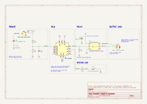

# HARDWARE — Adaptive Controller

Electrical design of the box. Parts and their status live in [BOM](BOM.md);
the invariants this design serves live in [SAFETY](SAFETY.md).



## 1. Blocks

| Ref | Block | Role |
|-----|-------|------|
| U1 | Seeed XIAO ESP32C6 | BLE, timing, battery charging (USB-C) |
| K1 | 3V relay module, optocoupler input, high-level trigger | Closes the output contacts |
| J1 | 3.5mm mono panel jack with tip switch | Output to the toy |
| BT1 | 3.7V 1000mAh LiPo, protected | Power |
| SW1 | SPDT slide switch, used as SPST | Power on/off |
| LED1 | 5mm LED, red, green or yellow | Status ([PRODUCT](PRODUCT.md) §5) |

The relay contacts provide the isolation between the box and the toy. On this
style of 3V module, the optocoupler and the coil share the controller's ground,
so the optocoupler does not add galvanic isolation. It limits the GPIO load to
the optocoupler's LED current.

## 2. Pin assignments

| XIAO pin | GPIO | Net | Function |
|----------|------|-----|----------|
| D10 | GPIO18 | RELAY_IN | Relay module IN. High = relay on. |
| D9 | GPIO20 | LED_DRV | Status LED through 220Ω |
| D0 / A0 | GPIO0 | VSENSE | Battery voltage, ADC1_CH0 |
| D1 | GPIO1 | — | Reserved for a future switch input (LP GPIO, can wake from deep sleep) |
| D2–D8 | | — | Unused |

Excluded pins and the reason for each:

| Pins | Reason |
|------|--------|
| GPIO4, 5, 8, 9, 15 | ESP32-C6 strapping pins. GPIO9 is the BOOT button; GPIO15 is the onboard user LED. |
| D6 / D7 (GPIO16/17) | UART0 TX/RX. The ROM bootloader transmits on TX at every reset. |
| GPIO3, GPIO14 | Onboard RF switch. GPIO3 low enables it; GPIO14 selects the antenna (low = onboard ceramic). Firmware leaves them at their defaults. |
| GPIO12, 13 | USB-Serial-JTAG: flashing and serial logs |

D9 and D10 sit on the same header edge as 3V3 and GND, so the relay's three
wires run in parallel.

Sources: [Seeed XIAO ESP32C6 wiki][seeed] (pin map, RF switch, battery
sensing); [ESP-IDF GPIO reference, ESP32-C6][idf-gpio] (strapping pins,
USB-JTAG pins, ADC1 channels).

## 3. Relay drive

- RELAY_IN has a **10kΩ pull-down (R3)** to GND. During reset, the GPIO is not
  yet driven, and the pull-down holds the relay off. With a weak internal
  pull-up active, the pull-down keeps the input well below the optocoupler's
  turn-on voltage.
- The relay module is powered from the XIAO **3V3** pin. The 5V pin exists only
  on USB power and would overdrive a 3V coil.
- **C2, 100µF** across the module's VCC/GND supplies the coil inrush locally.
  This prevents a brownout when the coil energizes during a BLE transmit burst
  on a partly discharged battery.

## 4. Current budget

| Load | Current | Basis |
|------|---------|-------|
| Relay coil (Songle SRD-03VDC-SL-C class) | ~120mA while on | [Datasheet via LCSC][relay] |
| Relay module IN (optocoupler LED) | A few mA from the GPIO | Module-dependent |
| Status LED | ~6mA | (3.3V − ~2.0V) / 220Ω. Blue and white LEDs (Vf ≈ 3V) are too dim at 220Ω and are not used. |
| R3 while relay on | 0.33mA | 3.3V / 10kΩ |
| Battery divider | ~20µA | 4.2V / 200kΩ |
| ESP32-C6 with BLE | Tens of mA | Measured in the bench test |

The relay's must-operate voltage is 75% of nominal (≈2.25V), so the relay keeps
working as the 3V3 rail follows a discharging battery below 3.3V.

## 5. Power path

```
BT1 + ──JST──► SW1 ──► VBAT ──► XIAO BAT+ pad
                         └────► R1 100k ─┬─ R2 100k ──► GND
                                         ├─ C1 100nF ─► GND
                                         └──────────► D0/A0 (VSENSE)
BT1 − ──JST────────────────────► XIAO BAT− pad = GND
USB-C ─► XIAO: powers the board and charges BT1 through the BAT pads
```

- SW1 disconnects the battery from everything, including the divider. Off
  draws zero current.
- Charging requires SW1 on ([PRODUCT](PRODUCT.md) §6).
- The XIAO ESP32C6 charges at about 100mA ([cnx-software][cnx]). A flat 1000mAh
  cell takes about 10 hours.
- R1/R2 form the 1:2 divider Seeed specifies for battery sensing on A0: 4.2V
  full charge reads as 2.1V. C1 gives the ADC a low-impedance source.

## 6. Output jack

J1 has three lugs: **sleeve**, **tip**, and **tip switch**. The tip switch rests
against the tip spring with no plug inserted, and opens when a plug is inserted.
Lug positions differ between vendors. The builder identifies them with a
multimeter:

1. Sleeve: continuity to the threaded bushing.
2. Tip and tip switch: continuity to each other with no plug inserted.
3. Tip: continuity to the plug tip with a plug inserted. The tip switch goes open.

Relay **COM → tip**, relay **NO → sleeve**. Relay NC and the tip-switch lug are
not connected. Relay contacts have no polarity, so the orientation does not
affect the toy.

The box has a female jack. A 3.5mm mono male-to-male cable connects it to the
toy's female jack. This is the same arrangement commercial switch extension
cables use.

## 7. Netlist

| Net | Connections |
|-----|-------------|
| VBAT_RAW | BT1 + · SW1 common |
| VBAT | SW1 outer pin A · U1 BAT+ · R1.1 |
| GND | BT1 − · U1 BAT− · U1 GND · K1 GND · R2.2 · C1.2 · R3.2 · LED1 cathode · C2 − |
| 3V3 | U1 3V3 · K1 VCC · C2 + |
| VSENSE | R1.2 · R2.1 · C1.1 · U1 D0 |
| RELAY_IN | U1 D10 · K1 IN · R3.1 |
| LED_DRV | U1 D9 · R4.1 |
| LED_A | R4.2 · LED1 anode |
| OUT_TIP | K1 COM · J1 tip |
| OUT_SLEEVE | K1 NO · J1 sleeve |
| No connect | K1 NC · J1 tip switch · SW1 outer pin B |

## 8. Facts pending measurement on the physical parts

| Fact | Checked in |
|------|-----------|
| Relay part number (coil current) | Bench test |
| Relay module IN current | Bench test |
| J1 lug identities | Build procedure |
| Battery connector type (JST-PH 2.0) and polarity | Build procedure |
| XIAO ESP32C6 charge current | Bench test |

[seeed]: https://wiki.seeedstudio.com/xiao_esp32c6_getting_started/
[idf-gpio]: https://docs.espressif.com/projects/esp-idf/en/stable/esp32c6/api-reference/peripherals/gpio.html
[relay]: https://www.lcsc.com/product-detail/C24585.html
[cnx]: https://www.cnx-software.com/2024/05/22/tiny-xiao-esp32c6-wifi-ble-and-802-15-4-iot-board-offers-up-to-16-gpio-pins/
